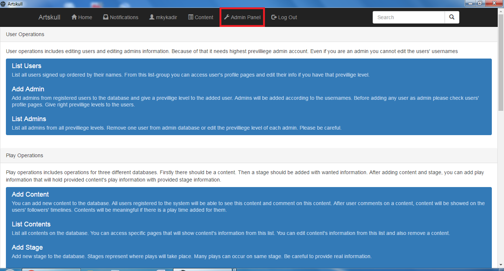

Admin Guide
===========

Artskull has two types of users, one of them is normal users that we guided above and other one of is admin users. Admin users are special for Artskull’s content. They have privileges to edit, remove or add contents to the web site. When normal users have problem about content inside Artskull, they are contacting with admin users.
Admin users are also categorized inside with three privilege levels.

- Lowest privilege level

These level admins can only edit information about theatre information, play information and stage information. 

- Medium privilege level

These level admins can edit comments that user made on another user's’ actions and also edit actions of users. Medium privilege level admins also have rights of lowest privilege level.

- Highest privilege level

These level admin can edit all users’ information and also edit the admin privilege levels of the system. Highest privilege level admins also have rights of lowest and medium privilege level admins’ rights.

It can be seen that only highest privilege admins can add more admins. So if you want to be an admin on your local system or your own pushed version of Artskull, use automatically created admin account. System creates an admin account at first installation with username “admin” and password “artskull”. You can login with this account and add another admin accounts.

**NOTE: Make sure that you add your personal account as admin account and delete automatically created admin account or just change the default password of automatically created admin account.**

When admin user logs into system “Admin Panel” section will be enabled on top menu:

Admin panel is specific for admin users and sub menus will be showed if the required privilege level met for that sub menu. So, for example admin with medium privilege or lowest privilege level will not be able see user operations since user operations need highest privilege level.

.. toctree::

   member1
   member2
   member3
   member4
   member5
