Parts Implemented by Furkan Özçelik
=================================

Content Operations
------------------
Content List
~~~~~~~~~~~~
Admins can list contents by clicking “Content” in main panel or “ Content List” in Admin Panel.
They can add,edit or delete content by clicking buttons in this page.

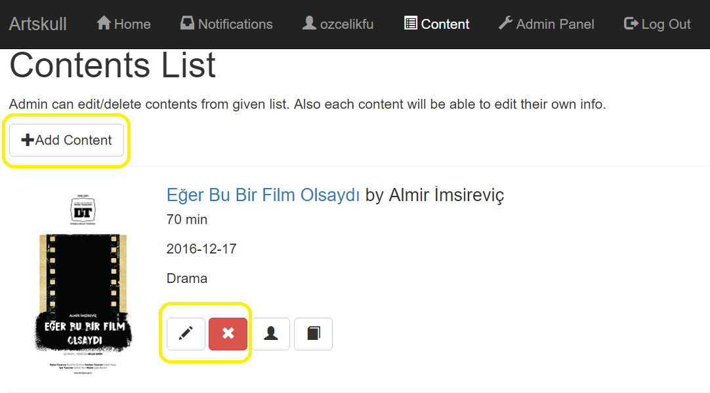

Content Add
~~~~~~~~~~~
Admins can add content by entering title, artist, duration, opening date,genre and link of picture then click submit button in content adding page.

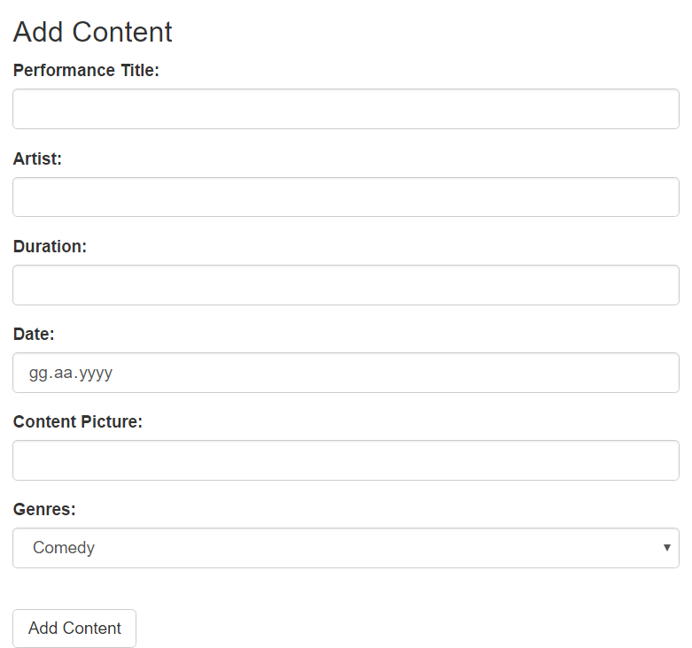

Content Edit
~~~~~~~~~~~~
Admins can edit an existing content’s information in content editing page.

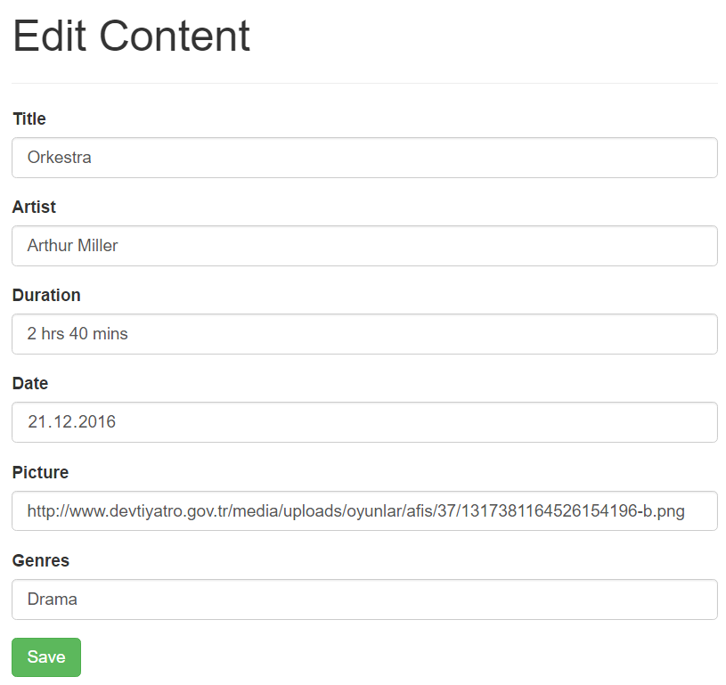

Content Delete
~~~~~~~~~~~~~~
Admins can delete contents by clicking delete button in content list page and then approve it in delete confirmation page.

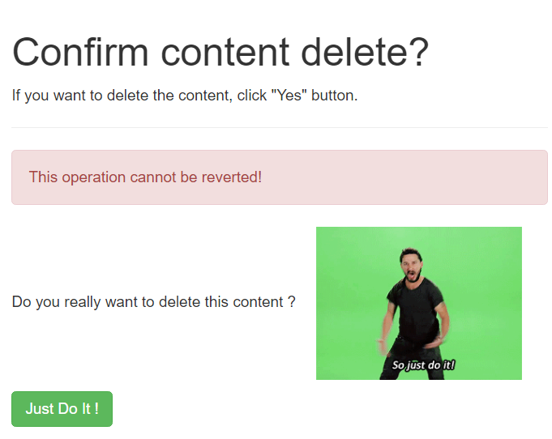

Stage Operations
----------------
Stage List
~~~~~~~~~~
Only admins can list stages and it can be done by clicking “Stages List” button in Admin Panel. Admins can add,edit or delete stages by clicking buttons in stage listing page.

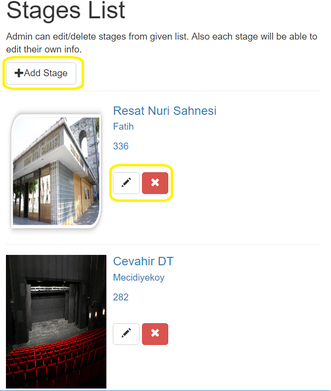

Stage Add
~~~~~~~~~
Admins can add stage by entering name, location,capacity and link of picture then click submit button in stage adding page.

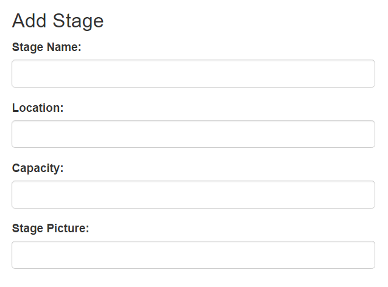

Stage Edit
~~~~~~~~~~
Admins can edit an existing stage’s information in stage editing page.

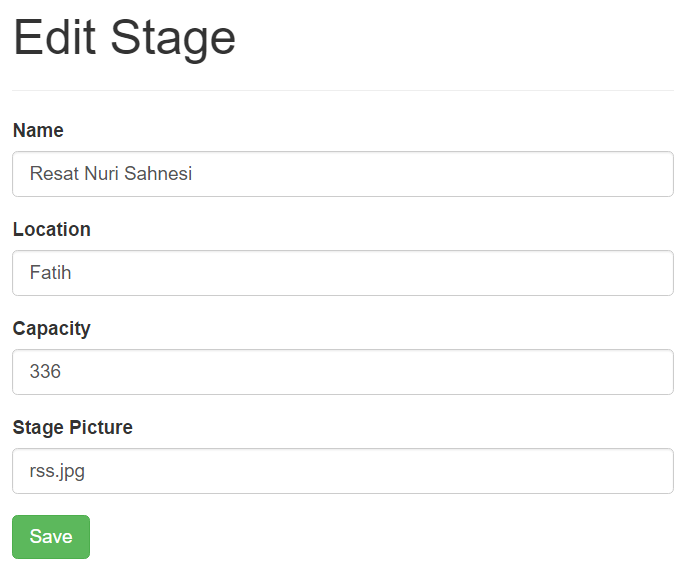

Stage Delete
~~~~~~~~~~~~
Admins can delete stages by clicking delete button in stage list page and then approve it in delete confirmation page.

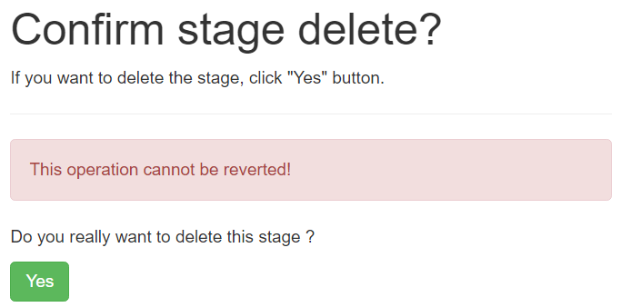

Play Operations
---------------
Play List
~~~~~~~~~
Only admins can list plays and it can be done by clicking “Plays List” button in Admin Panel. Admins can add,edit or delete stages by clicking buttons in stage listing page.

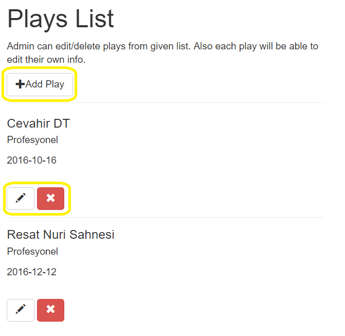

Play Add
~~~~~~~~
Admins can add play by choosing stage, content and enter the session date then click submit button in play adding page.

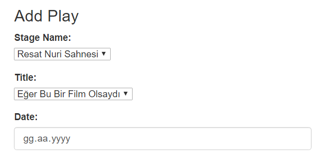

Play Edit
~~~~~~~~~
Admins can edit an existing play’s information in play editing page.

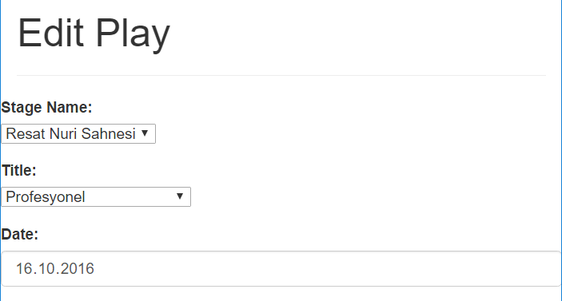

Play Delete
~~~~~~~~~~~
Admins can delete plays by clicking delete button in play list page and then approve it in delete confirmation page.

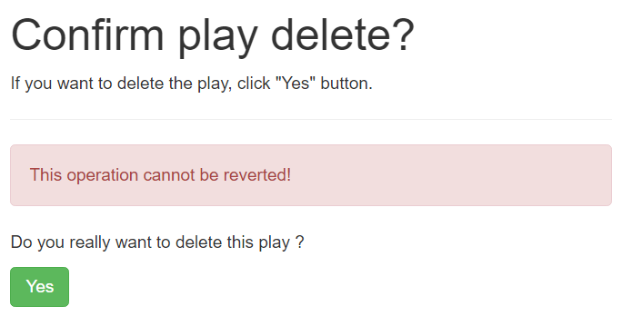
