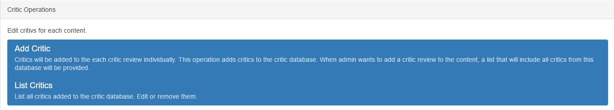
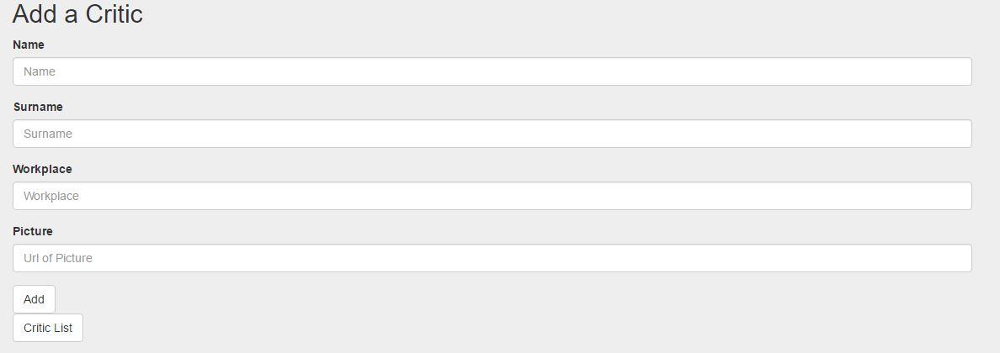
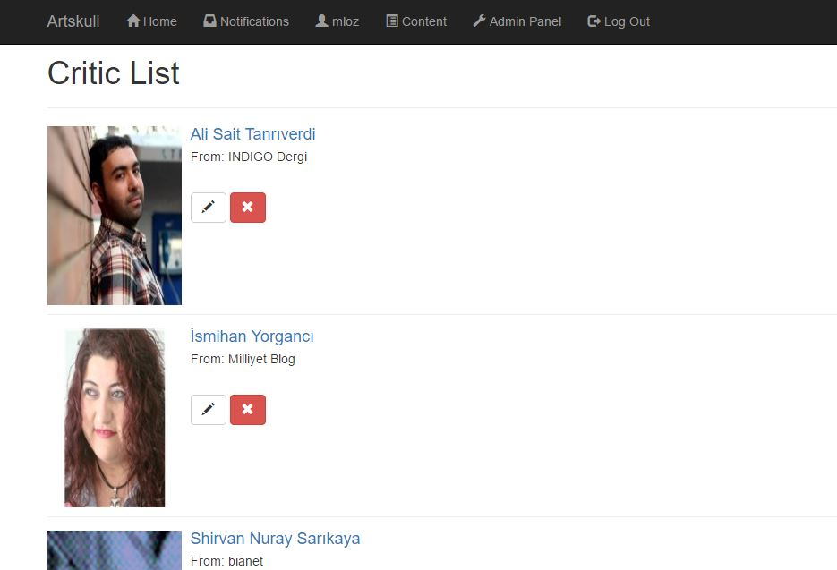
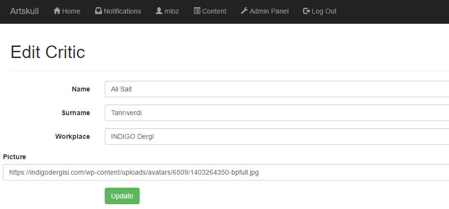
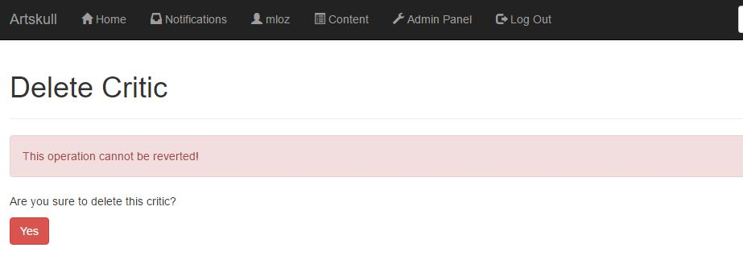
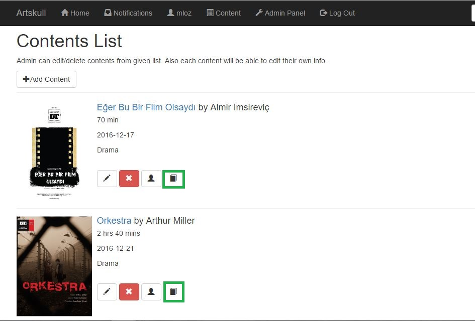
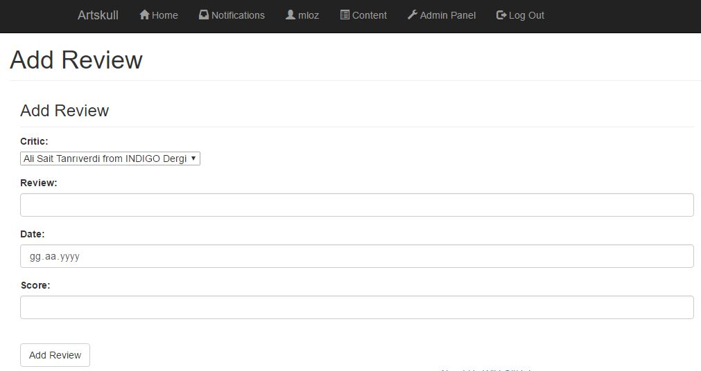
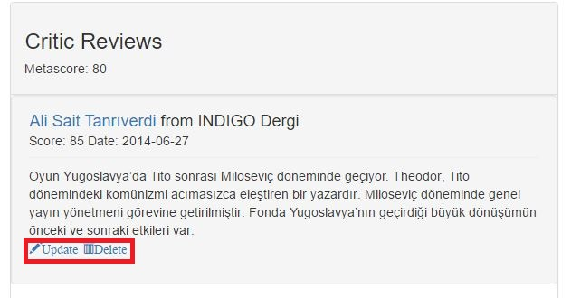
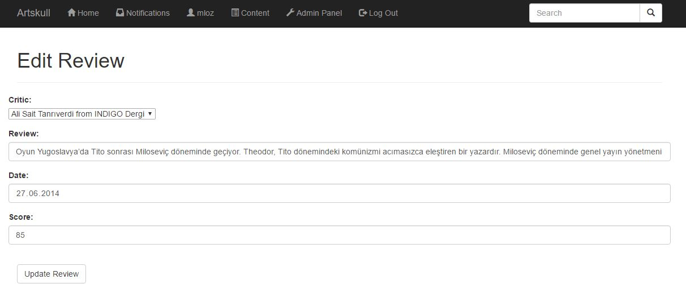
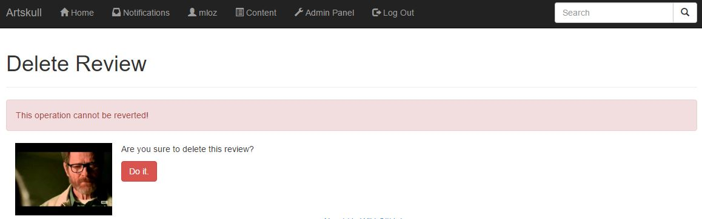

Parts Implemented by Mahmut Lutfullah Özbilen
=================================
Critic
------
Critics can only be added, deleted, and edited by admins.  

Critic Add
~~~~~~~~~~
New critics can be added on the admin panel.

Required has to be filled correctly by admin.

Critic List
~~~~~~~~~~~
Critics are listed on the critic list page. Update and delete buttons can be found there. 

Critic Edit
~~~~~~~~~~~
Admins can edit critic on the critic edit page.

Critic Delete
~~~~~~~~~~~~~
Critics can be deleted by admin on critic delete page.

Review
------
Reviews can only be added, deleted, and edited by admins.

Review Add
~~~~~~~~~~
Reviews add button can be found on the content’s list (★).

   

Review Edit and Delete Buttons
~~~~~~~~~~~~~~~~~~~~~~~~~~~~~~
Review edit and delete buttons can be found on related review. This buttons are visible to only admins.

Review Edit
~~~~~~~~~~~
Admins can edit review on the review edit page

Review Delete
~~~~~~~~~~~~~
Admins can delete review on the review delete page.

