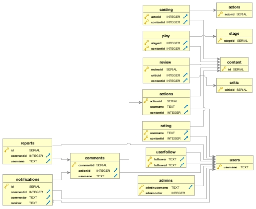

Developer Guide
===============
Artskull is an open source web application based on Python and it is using Flask microframework. Artskull’s source code can be found on GitHub at https://github.com/itucsdb1610/itucsdb1610 . You can download the source code and work on it. You can change the parts of the code to make it suitable for your work. In this part this document will help you through understanding the source code and its structure.

.. toctree::

   member1
   member2
   member3
   member4
   member5
   
ER Diagram
----------
In this diagram only referenced and primary keys of tables are showed, not all attributes of tables are listed.

Source Code Directory Structure
-------------------------------
When you clone the source code from GitHub, you will face with the following structure

**static**
Contains static files that are using for styling the website and some sample images to fill blank areas that user may not want to fill.

**static/css**
Contain Bootstrap’s style file (bootstrap.min.css) and another style file to fix some unwanted glitches from Bootstrap defaults (bootstrapfix.css).

**static/fonts**
Font files that Bootstrap needs to work properly.

**static/js**
JavaScript files that Bootstrap needs to work properly.

**templates**
Contains HTML files that user see on screen. These are template files that Flask will fetch and render on screen.

**Procfile**
File that Bluemix platform needs and determines which file should executed when application starts.

**README.md**
Read me file for project that is on the GitHub page.

**action.py**
Python file that holds definition of Action class. Action class is the class to hold users’ actions.

**actor.py**
Python file that holds definition of Actor class.

**comment.py**
Python file that holds definition of Comment class

**content.py**
Python file that holds definition of Content class.

**follower.py**
Python file that holds definition of Follower class.

**initdb.py**
Python file that holds methods for interaction between database and all queries used in this project.

**manifest.yml**
File that Bluemix needs and defines some information about application that will run on Bluemix.

**notification.py**
Python file that holds definition of Notification class.

**report.py**
Python file that holds definition of Report class.

**requirements.txt**
Text file that shows requirements of Python packages. It can be a reference for developers before building the environment for Artskull development. Bluemix needs that file.

**runtime.txt**
Text file that Bluemix needs and shows what applications should Bluemix execute. It can be a reference for developers to determine required minimum Python version.

**server.py**
Main program file which is a Python file. Bluemix platform and developers for local platforms will run this file. This file contains methods for all pages and calls for query methods.

**stage.py**
Python file that contains definition of Stage class.

**user.py**
Python file that contains definition of User class, hashing method for password can be found in this file.

How Template Works?
-------------------
Flask microframework has built in Jinja 2 templating platform inside. In Artskull, we have created a general layout file that can be found in “templates/layout.html”. On each page you will see a top menu bar and a bottom summary part in application, this file contains that parts of the application. Only the center of the content will render the required template file.

.. code-block:: html

	<!-- ...other HTML code -->

	<nav class="navbar navbar-inverse navbar-fixed-top">
	
	<footer class="footer" style="text-align: center;">

	<!-- other HTML code… -->
	
Each template page will be rendered at the middle of the page(inside of block content) by Jinja.
Other pages have to specify the layout page with following syntax

.. code-block:: python

	
	Log In
	

	<!-- some HTML code -->

	
	
To render a template you need to import “render_template” from Flask and call render_template method with provided HTML file for template page.

.. code-block:: python

	from Flask import render_template

	## ...some Python code

	return render_template(‘index.html’)
	
Defining Routes for Methods
---------------------------
In Flask, each method can be accessed from URL route. When browser navigates that URL, directed method to that URL will be executed. Following method will run  “home” method when browser navigates to main route (‘/’)

.. code-block:: python

	@app.route('/', methods=['GET', 'POST'])
	def home():
	## some Python Code
	
You may notice that there is a parameter called “methods”. These are HTTP methods that web developers may be familiar which are ‘GET’ and ‘POST’ that we have used. GET method can be taught as basic HTTP request without information sent. But in POST methods we are sending some data. Below code section will show how we handled the methods:

.. code-block:: python
	
	if request.method == 'GET':
        getuser = getuser_usertable(app.config['dsn'], username)
        return render_template('useredit.html', user=getuser, username=username)
    else:
        name = request.form['inputName']
        surname = request.form['inputSurname']
        email = request.form['inputEmail']
        password = request.form['inputPassword']
        profpic = request.form['inputProfPic']
		
Database Operations
-------------------

Artskull creates all tables during first start of application. Then application will be ready for other queries. All queries can be found inside of “initdb.py” file. 
