Installation of Artskull
========================

Artskull is a web based application that needs Python and PostgreSQL to work. So installation guide will consist of five parts and you should follow them step by step to get full experience of Artskull. Since Artskull needs 3rd party applications to work this guide will cover only basics of installation of that applications. You should follow the detailed instructions for that 3rd party applications.
Artskull should work on any operating system if the minimum version of required 3rd party applications and packages still supports that operating system.

Installation of 3rd part applications
-------------------------------------
You don’t need to install any 3rd party applications if you just want to run the application on Bluemix platform. But you have to install these applications to run Artskull on local computers.

**Python and Required Packages**

Artskull is Python based application so local computer has to have a Python running at least version 3.5.
Installation on Windows:
	- Download Python 3.5 or higher version from here_.

.. _here: http://www.python.org/

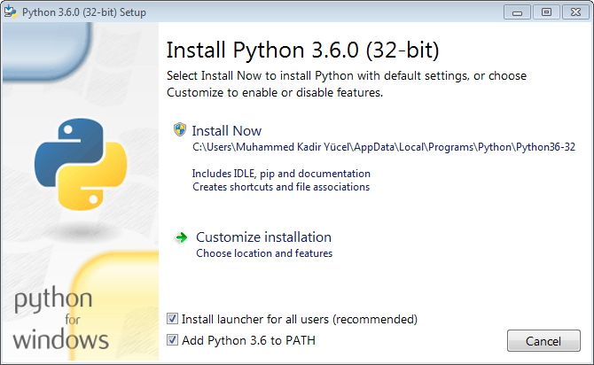

- Open the installation file and you should see a similar screen like that
- Make sure that you have selected “Add Python to PATH”
- Then click “Install Now”, you may need admin privileges.
- After installation finishes restart the computer.
	
Most of the Linux based systems have Python pre-installed. If you want to check if it is installed do the followings:

	- Open terminal
	- Write “python3 --version”
	- Hit enter. If there is a version number returned you have Python installed on your system
	
Installation of Python may change during time after this user guide was created. Please check official documentation of Python installation. Also this guide cannot cover installation of the Python for other systems please check official guide again.

**Flask**

Flask is a Python microframework that Artskull needs to work. Since it is an Python microframework you don’t need to download an executable to install it but you have to have a Python installation working on your system.

Installation Windows
	- Open command prompt
	- Write “python -m pip install Flask” and hit enter
	
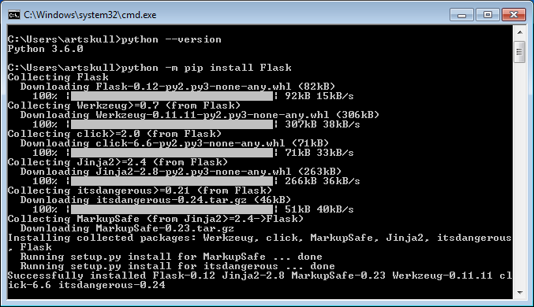
	
Installation Linux
	- Open terminal
	- Write following command “python3 pip install Flask”
	- Hit enter, Python will install the package
	
Installation may change during time, please check official documentation of Flask.

**Psycopg2**

Psycopg is a Python package that helps to connect PostgreSQL based databases to applications written in Python. It is an PostgreSQL adapter for the Python. You should have PostgreSQl installed on your computer.

Installation on Windows
	- Open command prompt
	- Write “python -m pip install psycopg2” and hit enter

Installation on Linux
	- Open terminal, terminal commands may change according to your Linux distribution
	- Write “python3 pip install psycopg2” and hit enter

Installation may change during time, please check official documentation of psycopg.

**PostgreSQL**

PostgreSQL is a database management system that Artskull needs it to work on a local system. Before installation of PostgreSQL we are suggesting that you should check minimum system requirements first. Because performance of your local computer will affect the query speed and this will affect the Artskull’s performance. If your computer fits into system requirements, please follow the steps.

Installation on Windows
	- Download required executable files from PostgreSQL website.
	- Open the installation file
	- Enter both password fields with “123456”.

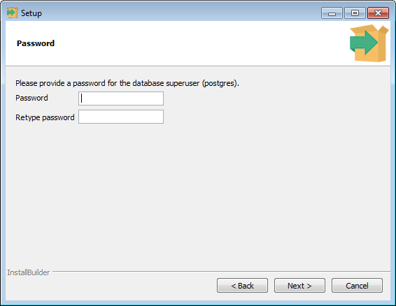
	
- Enter port “5432”
	
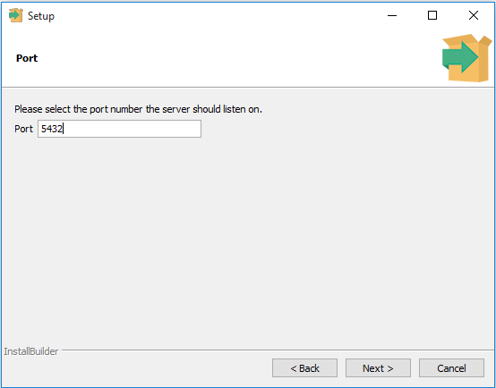
   
- Then leave every other setting as it is and finish installation.
- Open pgAdmin program and double click first server under “Servers” enter password given during installation if prompted (it may 123456)
	
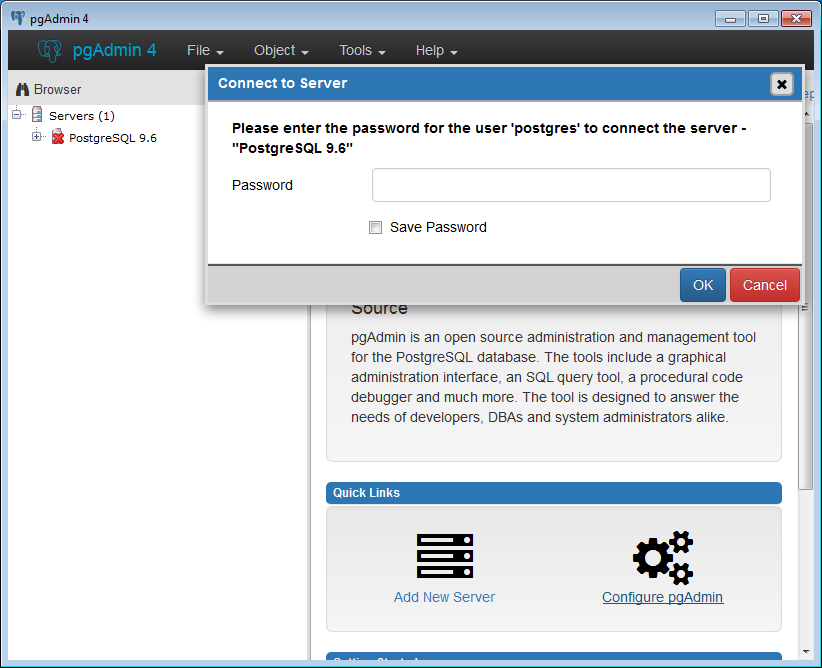

- Right click on the “Databases” and then click “Create -> Database …”
	
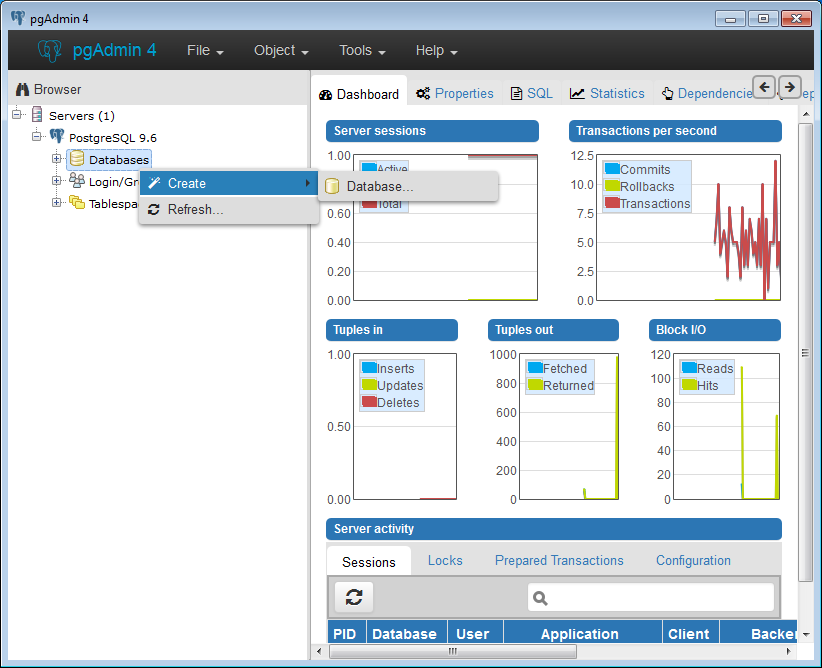
  
- Enter “itucsdb1610” into database and leave other settings as it is.
	
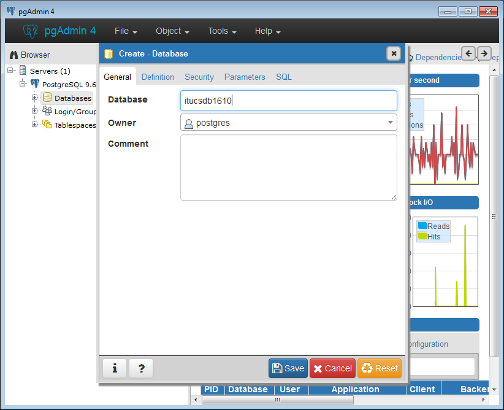
	
- You can close pgAdmin program.

Installation methods may change during time please check official installation documentation from here. But steps for giving a password to admin account of SQL server should be applied properly. If you couldn’t give right password to your admin account or right port of SQL server or you want it to be different you have to change the code of Artskull (we are not recommending that if you want to contribute the project). 

**Changing Server Information Inside Artskull Code**
After you downloaded the code from GitHub, you should open “server.py” file with your favorite text editor. Go to the end of the file(it should be in line 1068) and change the value inside the single quotes that are next to “password=” according to your current password. You can also change the username if default admin username of PostgreSQL is changed during time. You can change “port” from here, also. This changes will only affect local installation.

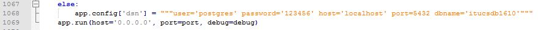

NOTE: Artskull will run in debug mode automatically in local computers, but on Bluemix platform it will run on release mode. So if you want to close debug mode on local systems make sure that at “debug=False” at line 1069 instead of “debug=debug”

**Artskull**
Artskull does not provide an executable installation method. If you want to install the Artskull on your local computer you have to get the source code from GitHub. You can get the code by using “git” program or directly from the GitHub page. This guide will show the steps for getting code from GitHub page.

	- Open a web browser and go to the https://github.com/itucsdb1610/itucsdb1610
	- From that page you should see a green button named as “Clone or download”
	- Click it and a popup menu should be opened. Click on “Download ZIP” button.

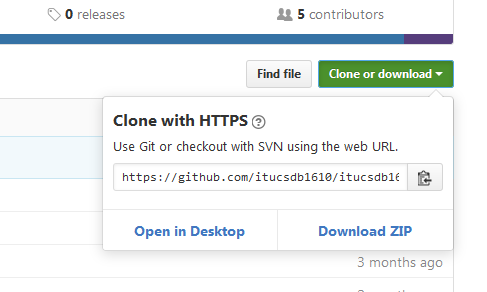

- After download completes, extract zip file into a folder.
- When extraction finishes, make sure that all required 3rd party applications were installed on your system and PostgreSQL server is running in background.

Running on Windows
	- Open command prompt inside where source code was downloaded.
	- You can do that by right clicking on folder while pressing shift button on keyboard.
	- You should see “Open command prompt here” menu there.
	- Write the following command: “py server.py”
	
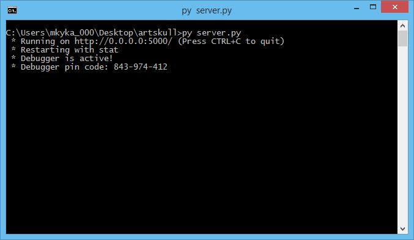
   
- If you see the above screen you can access the application locally from a web browser by going into http://localhost:5000/
	
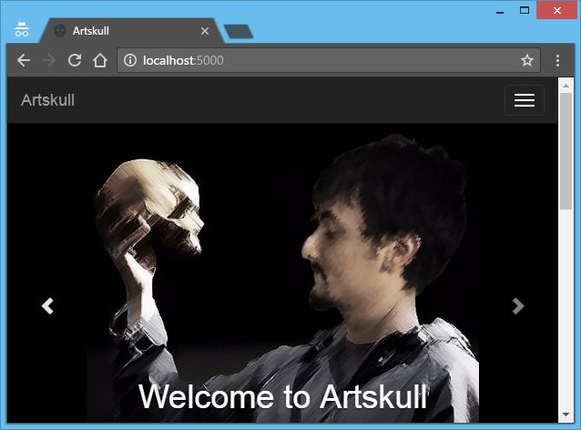
   
Running on Linux

	- Open terminal and change direction to the Artskull’s code directory
	- Then write “python3 server.py” to the terminal and hit enter.
	- If you see the above screen, open a browser and go to the http://localhost:5000/

Running on Bluemix
	Artskull source code comes with required files and settings for Bluemix platform already. You don’t need to set things again for Artskull but you need to create an Bluemix account to work with Bluemix.

	- Register for a Bluemix account from here.
	- Log in with your account from Jazz Hub
	- After following steps and logging in to application get into “My Projects” tab.
	- Click on “new project” link
	

	
- Give a name to your application, it does not matter for Artskull and select proper option for you. When you commit into your repository, Bluemix will automatically build the new version. If you want to create a new repository and then push the code inside select “Create New Repository” option. If you already pushed the source code on GitHub select second option.
	
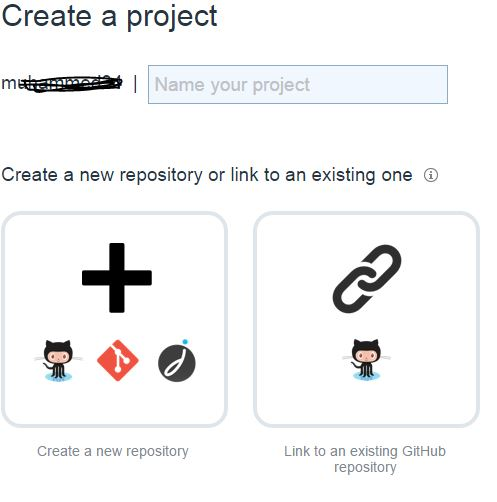
	
- After pushing code or linking repositories Bluemix will run on the host defined by Bluemix. You can check status of database and application from console.

