Parts Implemented by Muhammed Kadir Yücel
=================================

Sign Up
-------
After you enter the Artskull first thing you will see is a welcome page. On the welcome page you will see a top menu bar, a slider with little information about application and a signup form.

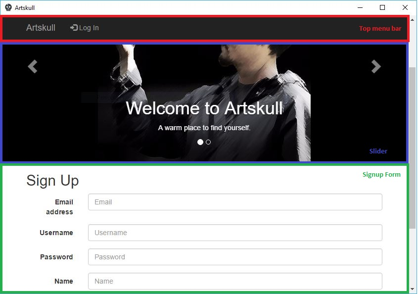

You have to fill all boxes to sign up. After giving all informations needed, click blue button named as “Sign Up” to sign up to the system. If system adds you to database successfully you will be directed to the login page. Systems wants from every user to use unique usernames and email addresses, if you give a username or email address already registered to the system, you won’t be registered and you will be redirected to the signup page to give unique informations.

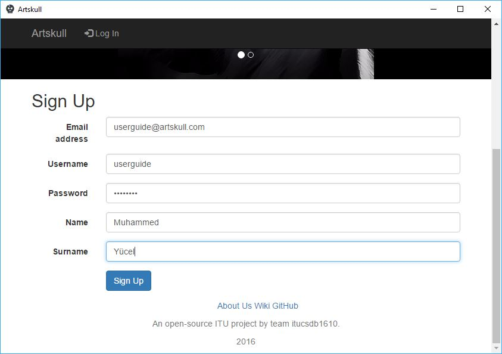

Log In
------
You can access the login page in two ways. First, you can click the menu item called as “Log In” on the top menu bar or after you register you will be directed to the login page. Login page needs two informations from user which are username and password that you gave in registration. You should give right information to the system, if system finds a matching user you should be directed to the your personal home, timeline page. If you entered wrong username or password i.e. system couldn’t find a matching user in system, you will be redirected to login page again.

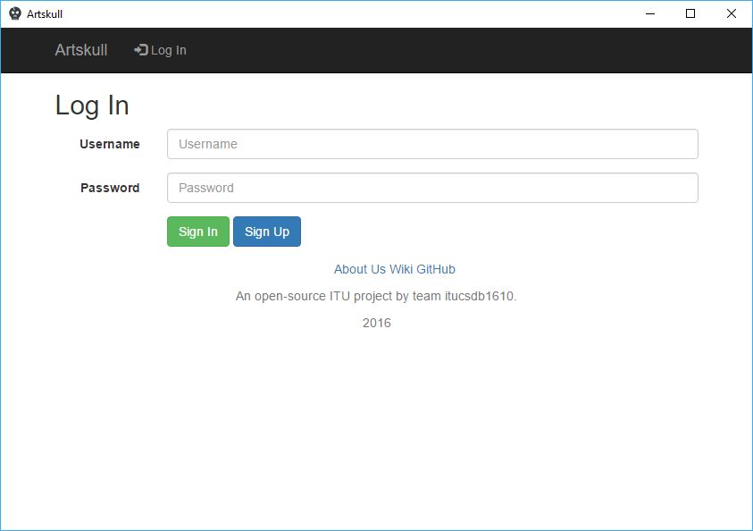

Profile
-------
After you login to the system, top menu bar and content of the web site should change. You can see your username on the top menu bar, if you click on there you should be directed to your profile page.
Profile page is the page that shows your personal information that you gave at registration. When other users search for you, they will see this page if they click on your name.

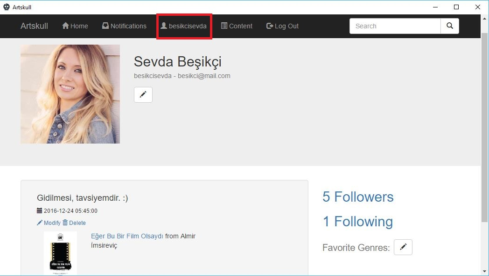

At the top of the profile page, your personal information can be seen(★). You profile picture, name, surname, username and email information is there and will be showed to all users that are entering your profile page. You can see your actions on your profile page(★). You can delete or modify your comments on contents from actions list in your profile page and also you can see direct links(★) for profile edit and favorite genres edit pages on your profile page. These buttons(buttons with pencil icons) will be showed only to you and admins that have highest privileges. Also you can see how many people that you are following and how many users that are following you(★). If you click on follow information you will be directed to a page that shows the list of the people of related information.

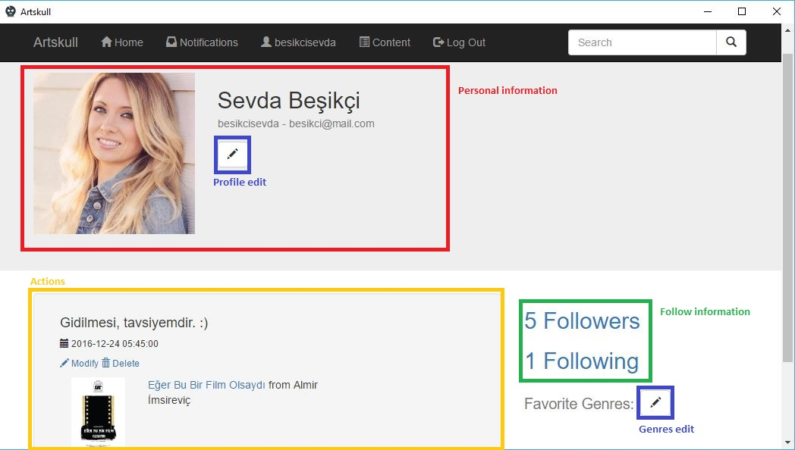

Editing User Information
------------------------
You can navigate to the user edit page by clicking profile edit button on your profile page(button with pencil icon under your name). From user edit page you can change the following informations:

- Your name and surname
- Your email
- Password
- Profile picture
- Genres
- Deleting account

This page will fetch your original data, if you want to change one of them just change that information and click green save button. You cannot change your username since it is a unique identification for the system. 
You can set your profile picture from here, you should provide a direct link to your image somewhere on the internet. Artskull does not provide a hosting for profile images. 
You may notice that password field is empty on edit page. Since we don’t hold password as plain text in database we don’t know your exact password. If you don’t want to change your password, leave password box empty. If you want to change your password, put a new password in that field.
You can edit your favorite genres’ list by clicking “Edit genres” button on that page.
You can permanently delete your account from the system by clicking red button named as “Delete account”. This will delete all of your information from system and your username will be available for new registrations, so be sure about deleting your account.

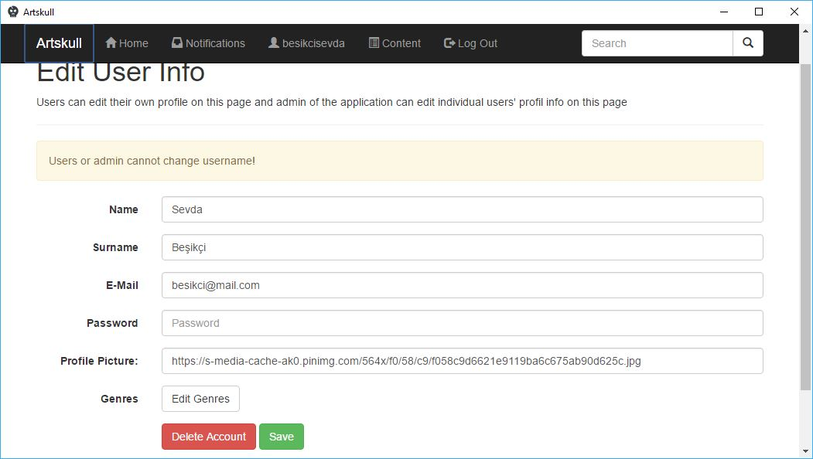

Editing Genre Information
-------------------------
Each user sets their own favorite genres list. They can select a genre and give an order to it. Favorite genres of user will be showed on their profile pages. You can see your favorite genres on your profile page and other users’ on their profile pages. You can find new friends that are also like same genres as you and you can find new contents in your favorite genres.
You can edit your genre information from genre edit page. You can access the genre edit page from your profile page(by clicking button next to favorite genres with pencil icon) or from user information edit page by clicking “Edit genres” button.

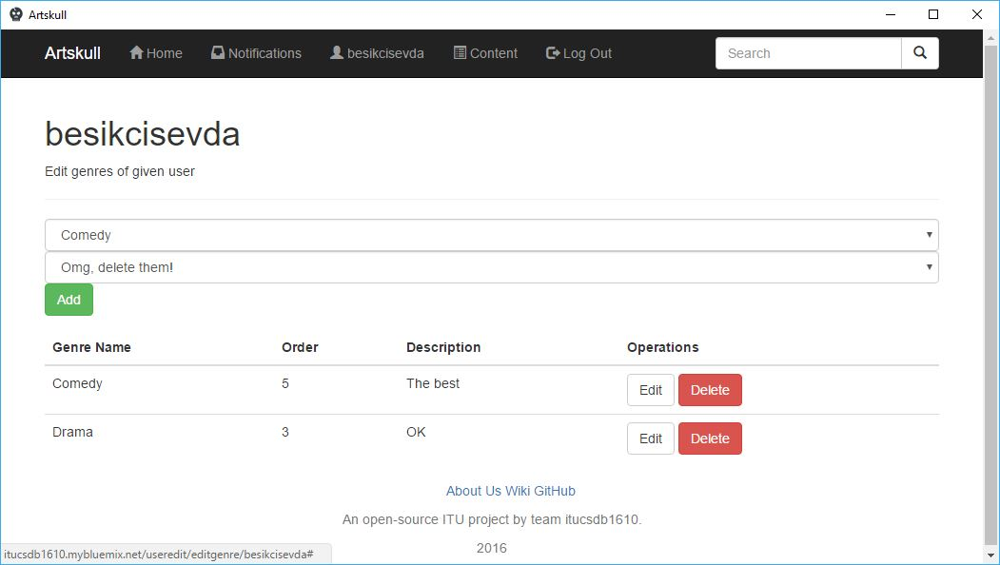

On genre edit page you can see a list of genres you have added before. You can edit specific genre from that list. You can change genre and order of genre by clicking “Edit” button of that genre. You can also delete the information that you gave about favorite genre.
You can add new genre information by using top part of page. You should select a genre from dropdown list and give your thought about genre from second dropdown list. Then click “Add” button, genre will be added to list and it will be showed in your profile by ordered by order information of genre.

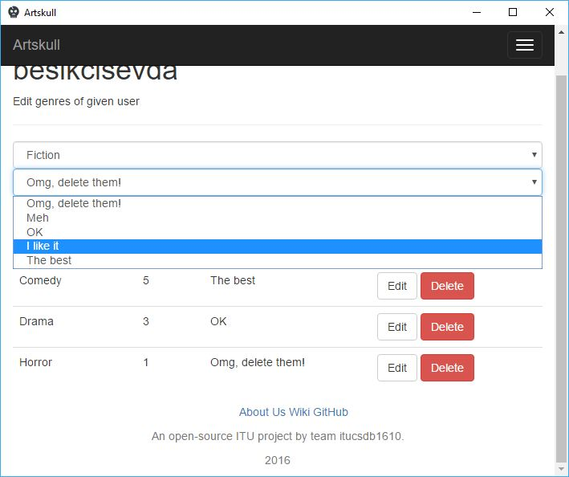

Finding Other Users
-------------------
You can find other users by using search box on the top menu bar. You can search users according to their:

- Username
- Email
- Name
- Surname

You don’t have specify anything to the system, you just enter the thing you want to search then hit enter or click search button. A list of users found will be showed. When you click on the user, you will be directed to the profile page of that user.

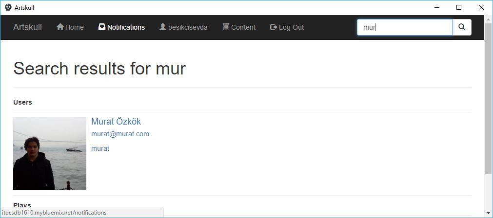

Following Other Users
---------------------
If you want to follow a user you have to visit profile page of the user that you want to follow. You will see a similar page to your own profile page but with small changes. Edit buttons will disappear and a green “Follow” button should appear if you are not following that user, if you are already following that user you should see a red button named as “Unfollow”. After following or unfollowing a user you will be redirected to timeline.
If you start to follow a user, actions of that user will be showed on your timeline.

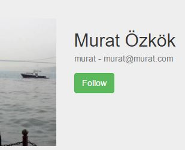
   
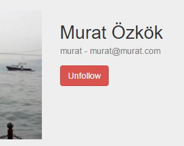

Listing Following Users
-----------------------
After following a user, that user should be added to your following lists and also you can see yourself on the list of followers of that user. You can list the following users by clicking link on your profile page that shows number of people:

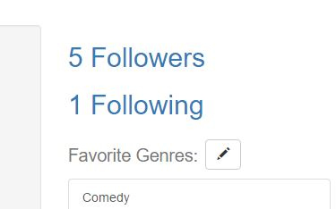
   
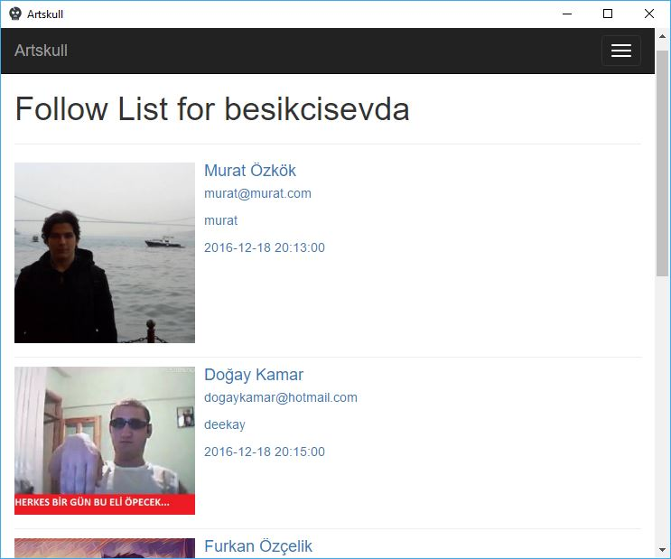
