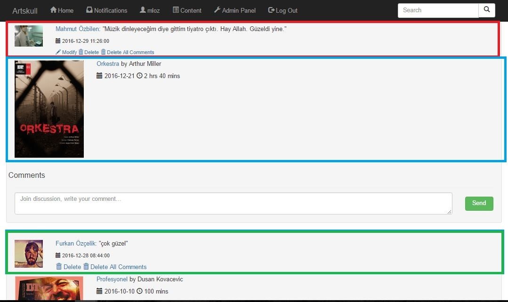
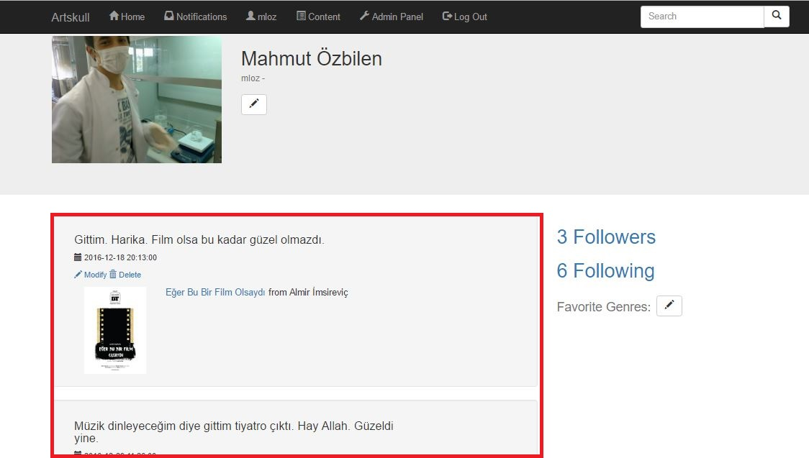
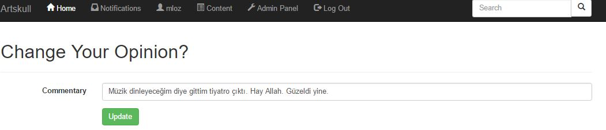
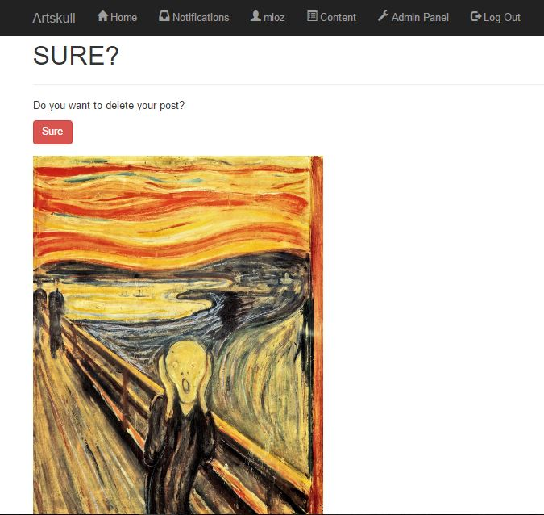
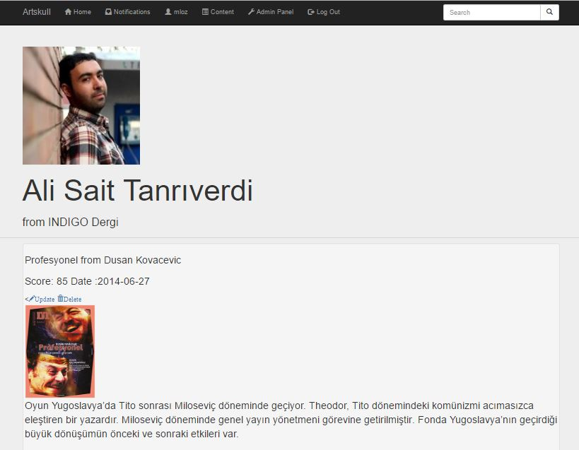
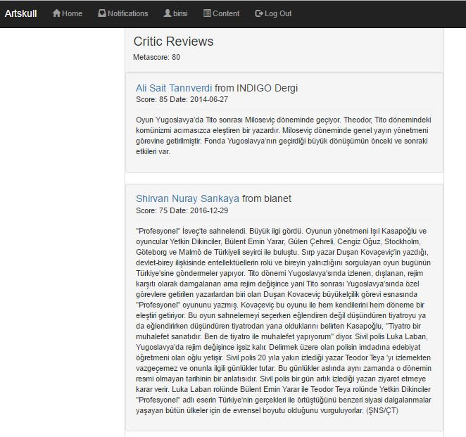

Parts Implemented by Mahmut Lutfullah Özbilen
=================================

Actions(Posts)
--------------
Actions also can be described as posts are activities of users on contents. Users can share their feelings, opinions, reviews on contents. Users add their actions on the related content’s page (★). Users also can see other users’ actions below of the add section. Commentary, user’s name, user’s profile picture, action date can be seen on the comments section (★).

Actions on Timeline
~~~~~~~~~~~~~~~~~~~
Users can also see their (★) and following users’ (★) actions on the timeline. On the timeline little information (★) about content can be seen below action. Users can also delete, update and delete all comment about action. 

Actions on the Profile Page
~~~~~~~~~~~~~~~~~~~~~~~~~~~
On the profile page users can see, update and delete their actions (★).

Edit Action
~~~~~~~~~~~
Users can edit their posted actions by clicking modify button. 

Delete Action
~~~~~~~~~~~~~
Users can delete their actions by clicking delete button. Confirmation is asked after clicking the button.

.. figure:: imguser/action5.jpg
   :scale: 50 %
   :alt: action5
   :align: center

Critics
-------
Critics are theater experts which writes reviews about plays. Users can see their reviews on the content’s page. Every critic have profile page. Critic page contains critic’s picture, name, surname, workplace and written reviews.

Reviews
-------
Reviews are opinions of critics. They can be seen by users on content’s page. Review contains critic’s information, review, score and date. Average score of content forms metascore.

