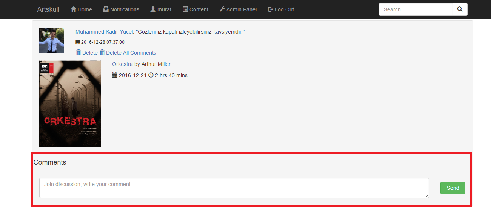
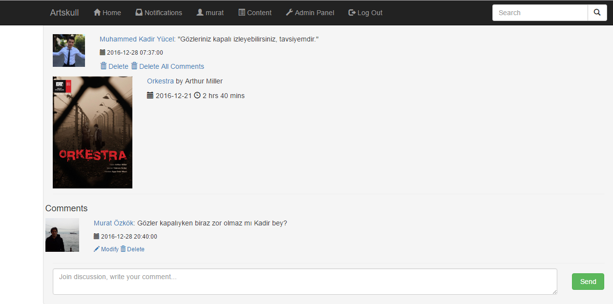
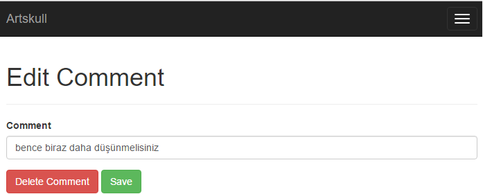
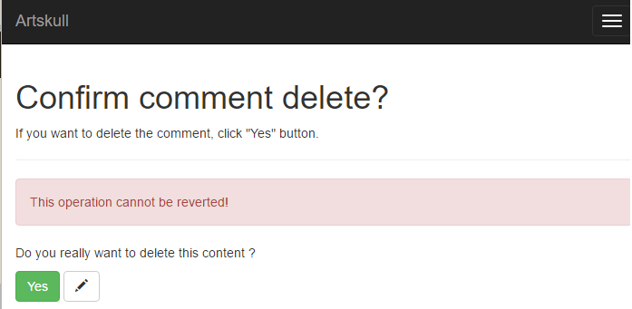
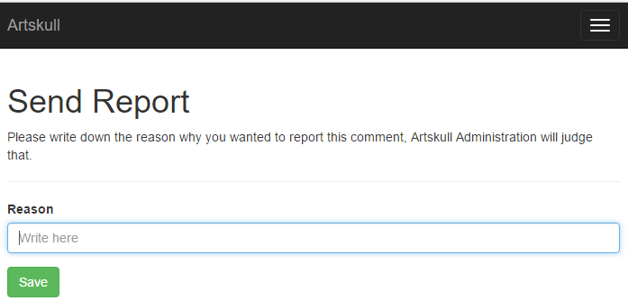
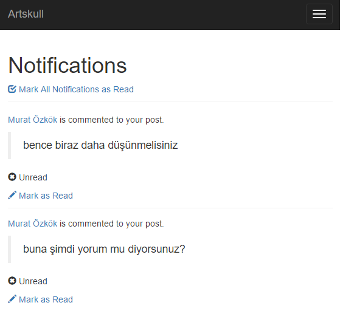

Parts Implemented by Murat Özkök
================================

Comments
--------
Users can comment each other’s posts to contents from timeline. User must follow users to comment to their posts. Users can delete all comments linked to their post to a content.  

   
Users can delete and modify comments of themselves. These options are only visible for commenter users and admins who have authorization on comments.

   
Edit Comment
~~~~~~~~~~~~
Comment Edit page, current comment is in textbox

   
Delete Comment
~~~~~~~~~~~~~~
Confirm Comment Delete page

   
Reports
-------
Users can also report comments of other users to Artskull Administration. Report button is under of each comment. User side of report system is that, admins can see reports and do operations from admin panel.

.. figure:: imguser/report1.png
   :scale: 50 %
   :alt: pythoninstall
   :align: center

   
Users write their reason why he/she wants to report comment after they clicked ‘Report!’

Notifications
-------------
Post writer gets notifications when a comment is written to a post in timeline from a different user from post writer. Users can access their notifications from the navbar in the head

   
User can mark as read his/her notifications one by one or all in one. Profile page of commenter user is accessible in each notification.
