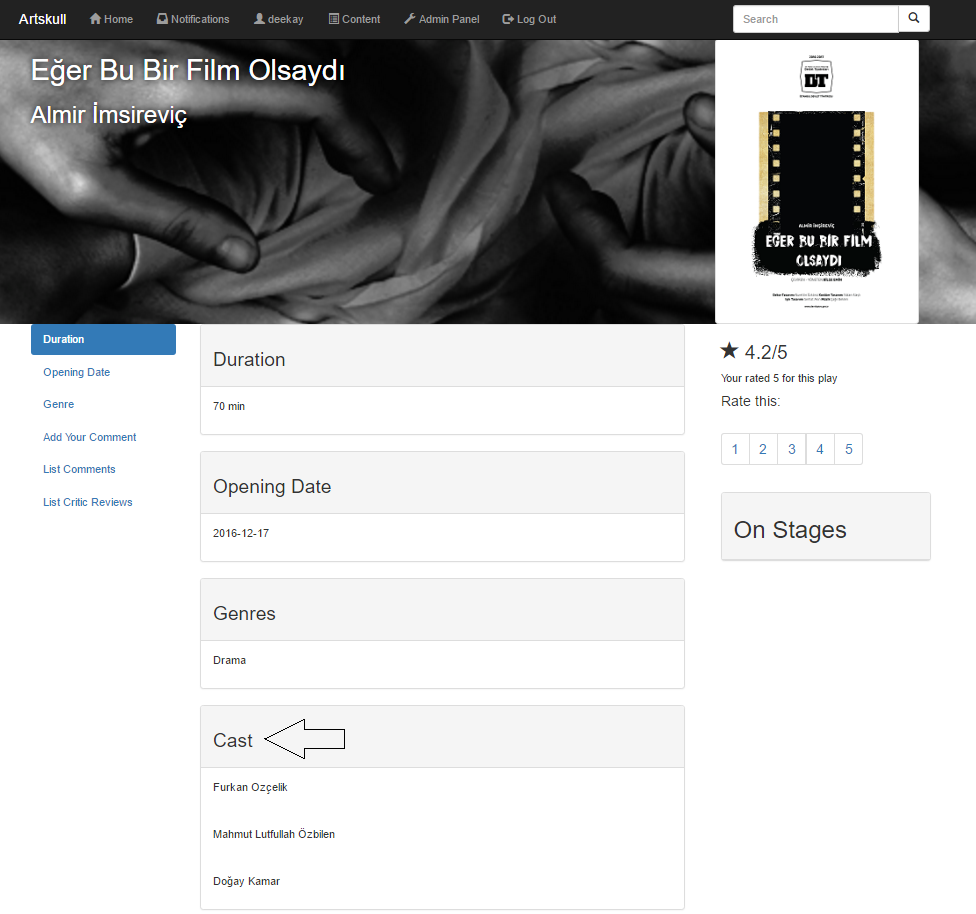
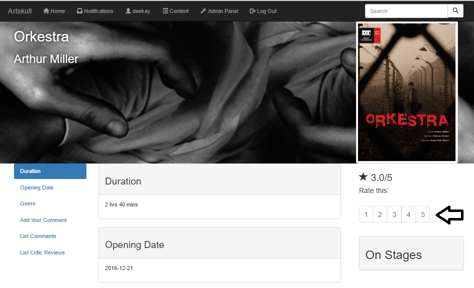
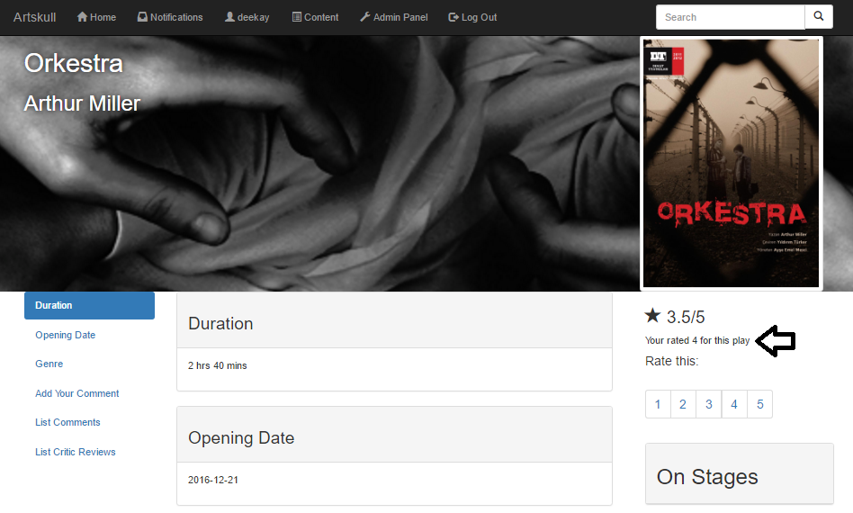

Parts Implemented by Doğay Kamar
=================================

Cast of a play
~~~~~~~~~~~~~
Cast of a play is seen by users in the webpage of a play. Cast of “Eğer Bu Bir Film Olsaydı” is seen in the below page.

Rating
------
Users can rate a play from their pages. There are 5 buttons numbered from 1 to 5 in the right side of the page. User can click on any of these buttons to rate the play. The average rating can be seen above the rating buttons, following a star sign. If a user has already rated a play, a message is seen between the average rating and rate buttons, informing what rating user has given to that play. User can update their ratings by clicking one of the 5 buttons, and their vote will be updated, affecting the average rating, too.

   

